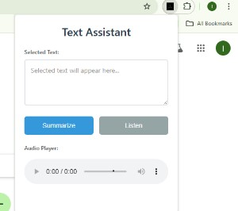

# Edge Accessibility Helper

A Chrome/Edge/Firefox extension I built to help with reading and understanding text on websites. It can summarize long articles and read text out loud.

## What it does

- **Gets text from websites**: Just select any text and it saves it
- **Summarizes stuff**: Makes long articles shorter and easier to understand
- **Reads text aloud**: Uses your browser's built-in speech feature
- **Works everywhere**: Any website, any type of content
- **Simple to use**: Clean popup with just a few buttons
- **Cross-browser support**: Works on Chrome, Edge, and Firefox



## Installation

### Method 1: Load Unpacked (Developer Mode)

#### For Chrome/Edge:
1. **Download or Clone** this repository to your computer
2. **Open your browser** (Chrome or Edge)
3. **Go to Extensions**:
   - Chrome: `chrome://extensions/`
   - Edge: `edge://extensions/`
4. **Enable Developer Mode** (toggle in top right)
5. **Click "Load unpacked"**
6. **Select the extension folder** from this repository
7. **The extension is now installed!**

#### For Firefox:
1. **Download or Clone** this repository to your computer
2. **Open Firefox**
3. **Go to Extensions**: Type `about:addons` in the address bar
4. **Click the gear icon** (⚙️) → "Install Add-on From File..."
5. **Select the `manifest.firefox.json` file** from this repository
6. **The extension is now installed!**

### Method 2: Use Pre-built Packages

We provide pre-built packages for easy installation:

- **Chrome/Edge**: Use `dist/edge-accessibility-helper.zip`
- **Firefox**: Use `dist/edge-accessibility-helper-firefox.zip`

## How to Use

1. **Select Text**: Highlight any text on a webpage
2. **Open Extension**: Click the extension icon in your browser toolbar
3. **Summarize**: Click "Summarize" to create an intelligent summary
4. **Listen**: Click "Listen" to hear the text read aloud

## How the summarization works

The extension looks at your text and picks out the most important sentences. It checks for:
- Sentences that define things (like "X is..." or "X means...")
- Sentences with names or numbers
- Sentences that give examples
- The first few sentences (usually the most important)

## How the speech works

- Uses your browser's built-in speech feature (no extra downloads needed)
- Picks the best voice available on your computer
- You can control how fast/slow it reads
- Works completely offline

## Technical stuff

- **Chrome/Edge**: Uses the latest extension format (Manifest V3)
- **Firefox**: Uses Manifest V2 for compatibility
- Only asks for minimal permissions (just to read selected text)
- Works on all websites
- Built with vanilla JavaScript (no frameworks)
- Cross-browser compatibility with separate manifests

## Browser Compatibility

- ✅ Google Chrome (version 88+)
- ✅ Microsoft Edge (version 88+)
- ✅ Mozilla Firefox (version 109+)
- ✅ Other Chromium-based browsers

## Project Structure

```
edge-accessibility-helper-main/
├── manifest.json              # Chrome/Edge manifest (V3)
├── manifest.firefox.json      # Firefox manifest (V2)
├── popup.js                   # Main extension logic
├── popup.html                 # Extension popup interface
├── popup.css                  # Extension styling
├── content.js                 # Content script for text selection
├── background.js              # Background service worker
├── icons/                     # Multi-size icon set
│   ├── icon-16.png           # 16x16 pixels
│   ├── icon-32.png           # 32x32 pixels
│   ├── icon-48.png           # 48x48 pixels
│   └── icon-128.png          # 128x128 pixels
├── build/                     # Build output directory
├── dist/                      # Distribution packages
│   ├── edge-accessibility-helper.zip          # Chrome/Edge package
│   └── edge-accessibility-helper-firefox.zip  # Firefox package
└── README.md                  # This file
```

## Why Multiple Manifests?

We use separate manifest files because:
- **Chrome/Edge** support Manifest V3 (newer, more secure)
- **Firefox** requires Manifest V2 (older format, but stable)
- This ensures maximum compatibility across all major browsers
- Users get the same experience regardless of their browser choice

## Distribution (dist/) Folder

The `dist/` folder contains pre-built packages for easy distribution:
- **`edge-accessibility-helper.zip`**: Complete Chrome/Edge extension package
- **`edge-accessibility-helper-firefox.zip`**: Complete Firefox extension package

These packages are ready to install and include all necessary files, making it easier for users to install your extension without needing to understand the technical details.

## Privacy

- Doesn't collect any of your data
- Everything happens on your computer (no internet needed)
- Doesn't track what you do

## Contributing

Feel free to help improve this! Just submit a pull request.

## License

This is open source under the [MIT License](LICENSE).

## Support

If something's not working or you have ideas to make it better, just let me know!

## Future ideas

- [ ] Add more voice options
- [ ] Let you save summaries to files
- [ ] Add keyboard shortcuts
- [ ] Support for other languages
- [ ] Let you choose how long summaries should be
- [ ] Add settings panel for customization
- [ ] Improve cross-browser feature parity

---

**Built to help make reading easier!**

**Now supporting Chrome, Edge, and Firefox for maximum accessibility!**